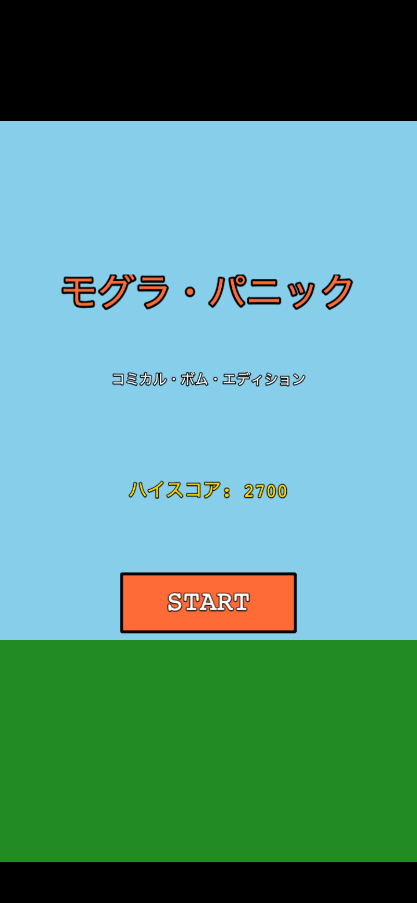
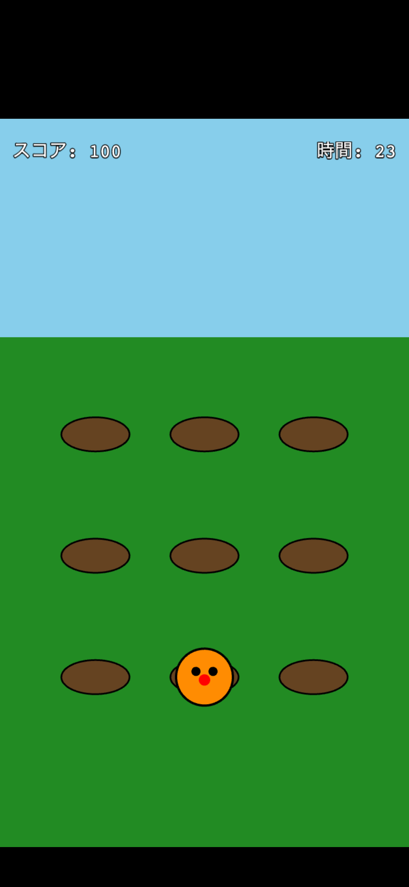
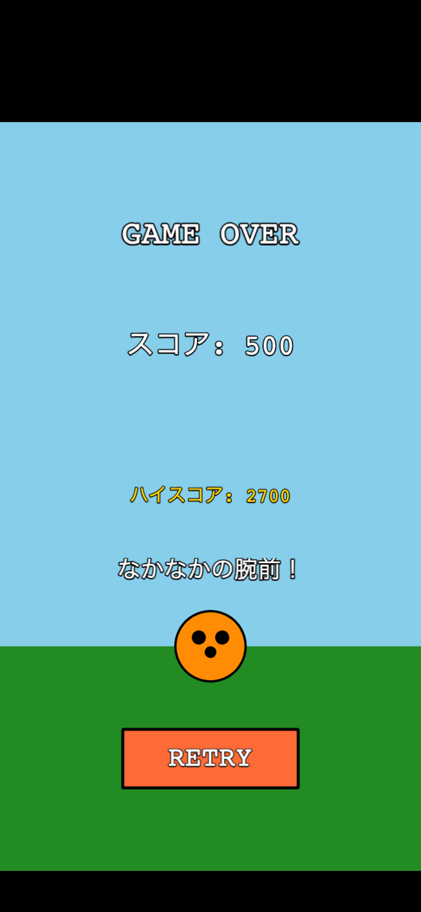

# モグラ・パニック

**コミカル・ボム・エディション**

ブラウザで遊べるモグラ叩きゲームです。制限時間内にできるだけ多くのモグラを叩いてハイスコアを目指しましょう！

## デモ

**[プレイする](https://k-anz.github.io/whack-a-mole-game/)**

## スクリーンショット

| スタート画面 | ゲーム画面 | リザルト画面 |
|:---:|:---:|:---:|
|  |  |  |

## ゲームの遊び方

### 基本ルール

- **制限時間**: 30秒
- **目標**: モグラを叩いてスコアを稼ぐ
- **操作**: モグラをクリック（タップ）するだけ！

### 登場キャラクター

| キャラクター | スコア | 効果 |
|:---:|:---:|---|
| モグラ（オレンジ） | +100点 | コンボが増加 |
| 爆弾（黒） | -200点 | 3秒減少＆コンボリセット |

### コンボシステム

モグラを連続でヒットするとコンボが増加します。5コンボごとに「COMBO!」エフェクトが表示されます。爆弾を叩くとコンボがリセットされるので注意！

### 難易度の変化

時間経過で難易度が上がります：

| 難易度 | 時間 | 出現間隔 | 同時出現数 |
|---|---|:---:|:---:|
| EASY | 開始〜15秒 | 1.0秒 | 最大1匹 |
| MEDIUM | 15秒〜25秒 | 0.6秒 | 最大2匹 |
| HARD | ラスト5秒 | 0.4秒 | 最大3匹 |

## 技術スタック

- **[Phaser 3](https://phaser.io/)** - 2D ゲームフレームワーク
- **Vanilla JavaScript** - ES6+ クラス構文
- **Web Audio API** - 効果音の生成
- **LocalStorage** - ハイスコアの保存
- **GitHub Pages** - ホスティング

## プロジェクト構成

```
whack-a-mole-game/
├── index.html          # エントリーポイント
├── game.js             # ゲーム初期化
├── styles.css          # グローバルスタイル
├── js/
│   ├── config.js       # ゲーム設定・定数
│   ├── StorageManager.js   # ハイスコア管理
│   ├── SoundManager.js     # 効果音生成
│   └── scenes/
│       ├── StartScene.js   # スタート画面
│       ├── MainScene.js    # メインゲーム
│       └── ResultScene.js  # リザルト画面
└── .github/
    └── workflows/
        └── deploy.yml  # 自動デプロイ設定
```

## ローカルで実行

ビルド不要で、簡単なHTTPサーバーがあれば動作します。

```bash
# Python 3 の場合
python -m http.server 8000

# Node.js の場合
npx http-server

# ブラウザで http://localhost:8000 を開く
```

## デプロイ

`main` ブランチにプッシュすると、GitHub Actions により自動的に GitHub Pages へデプロイされます。

## ライセンス

MIT
